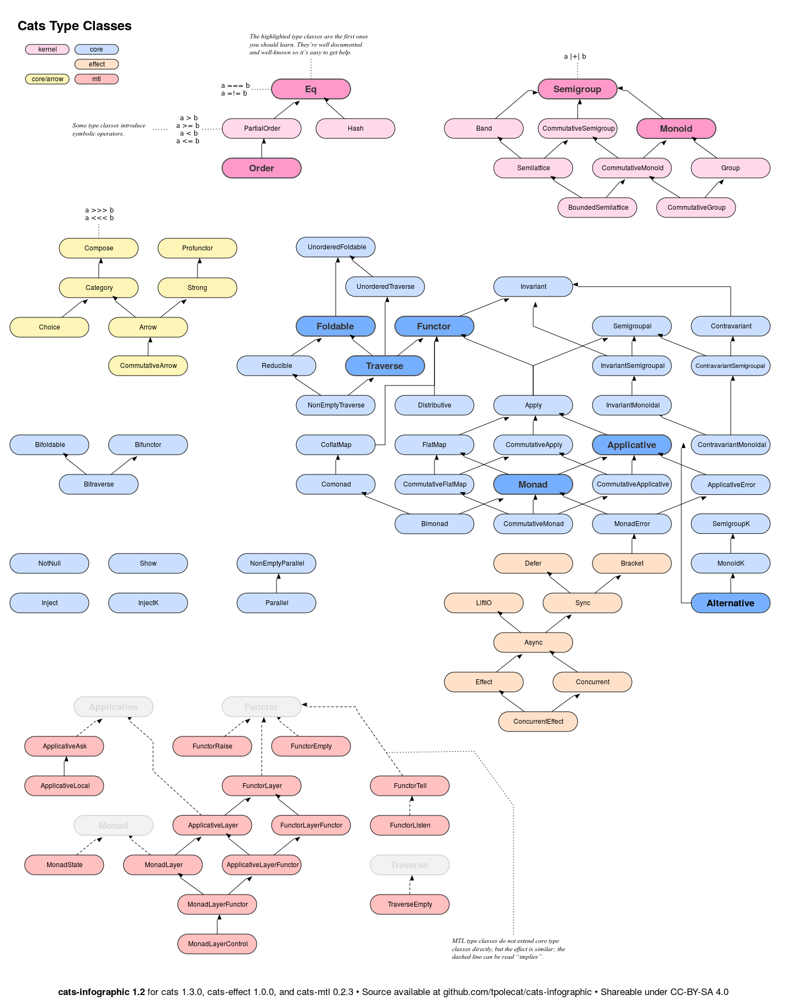
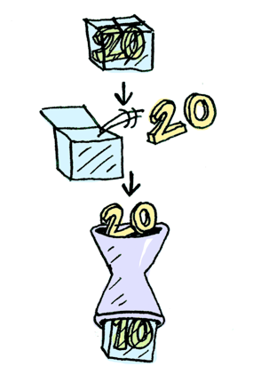

# Scala


Typeclasses fonctionelles

---

## Origines

- Premier papier en 1988
- Philipp Wadler and Stephen Blott
- Apparues en Haskell
- Puissant outil de polymorphisme ad hoc
- Permet la programmation par effet

---

## Polymorphismes

- polymorphisme paramétré: Définition **unique** pour un type paramétré
- polymorphisme ad hoc: Définitions **multiples**, une par type éligible
- polymorphisme par sous-typage: Définitions **multiples**, un par type sous-type

---

### Polymorphisme paramétré

```scala
def head[A](l: List[A]): Option[A] =
  l match {
    case Nil => None
    case h :: _ => Some(h)
  }
```

---

### Polymorphisme paramétré

```scala
def size(l: List[_]): Int =
  l match {
    case Nil => 0
    case _ :: t => 1 + size(t)
  }
```

---

### Polymorphisme ad hoc (surcharge)

```scala
def size(s: String) = s.length
def size(l: List[_]) = l.length
def size(s: Set[_]) = s.size
```

---

### Polymorphisme ad hoc (surcharge)

```scala
def doubleSize[A](a: A) = 2 * size(a) // ne compile pas
```

- Solution simple mais limite la réutilisation de code
- Il n'existe pas d'abstraction commune entre les types éligibles

---

### Polymorphisme ad hoc (typeclasses)

```scala
sealed trait Size[A] { def size(a: A): Int }

implicit val ev = new Size[String] { def size(s: String) = s.length }

def doubleSize[A: Size](a: A) = Size[A].size(a) * 2
```

---

## Les typeclasses fonctionelles 

- Nombreuses
- Souvent avec un haut niveau d'abstraction
- Non matérialisées en Scala
- Des hiérarchies avec des fonctionalités et **propriétés** grandissantes

---

## Typeclasses dans cats



---

## Première hiérarchie

- Semigroup
- Monoïde

---

### Semigroup

```scala
trait Semigroup[A] {
  def combine(x: A, y: A): A
}
```

Exemples de semigroupes ?

---

### Exemples de semigroupes

- String
- Int
- Option[A] (A: Semigroup)
- List[A] (A: Semigroup)
- Map[K, V] (V: Semigroup)

- Function1[A, B] (B: Semigroup)

---

### Utilisation de semigroupes

```scala
def reduce[A](l: List[A])(implicit S: Semigroup[A]) =
    l.reduce(S.combine)
```

---

### Semigroupes - Propriétés 

- Composition interne
∀ x ∈ *E*, y ∈ *E*, x + y ∈ *E*

- Associativité
(x + y) + z = x + (y + z)

---

### Monoïde

```scala
trait Monoid[A] {
  def empty: A
  def combine(x: A, y: A): A
}
```

Exemples de monoides ?

---

### Exemples de Monoïdes

- String
- Int
- Option[A] (A: Monoid)
- List[A]
- Map[K, V] (V: Monoid)

- Function1[A, B] (B: Monoid)

---

### Contre-exemples (semigroup sans monoide)

- NonEmptyList[A]
- NonEmptyX...
- Non-empty strings

---

### Utilisation de monoïdes

```scala
def fold[A](l: List[A])(implicit M: Monoid[A]) =
    l.fold(M.empty)(M.combine)
```

---

### Aller plus loin

- CommutativeSemigroup[A]
- Band[A]
- Semilattice[A]
- ...

---

### Monoïdes - Propriétés

- Associativité
(x + y) + z = x + (y + z)

- Identité (droite et gauche)
x + *e* = *e* + x = x

---

## Deuxième hiérarchie

- Foncteur[F[_]]
- Applicative[F[_]]
- Monade[F[_]]

---

### Foncteur

```scala
trait Functor[F[_]] {
  def map[A, B](fa: F[A])(f: A => B): F[B]
}
```

Exemples de foncteurs ?

---

### Foncteur - Illustration


---

### Exemples de foncteurs

- List[_]
- Option[_]
- Either[A, _]
- Id[_]
- Const[K, _]
- Future[_]

---

### Foncteurs - Propriétés

- Composition
fa.map(g.f) = fa.map(g).map(f)

- Identité
fa.map(identity) = fa

---

### Utilisation de foncteurs

```scala
Functor[Option].map(Some(3))(x => x + 10) // Some((13))
Functor[Option].tupleLeft(Some(3), 4) // Some((3, 4))
```

---

### Composition de foncteurs

Les foncteurs se composent

```scala
val F = Functor[Future].compose(Functor[List]).compose(Functor[Option])

F.map(Future(List(Option(2))))(x => x + 1) // Future(List(Option(3)))

```

---

### Applicative

```scala
trait Applicative[F[_]] {
  def pure[A](x: A): F[A]
  def ap[A, B](ff: F[A => B])(fa: F[A]): F[B]
}
```

Exemples d'applicatives ?

---

### Applicative - Illustration


---

### Exemples d'applicatives

- List[_]
- Option[_]
- Either[A, _]
- Id[_]
- Future[_]

---

### Applicatives - Propriétés

- Identité
pure(identity).ap(x) = x

- Homomorphisme
pure(f).ap(pure(x)) = pure(f(x))

---

### Utilisation d'applicative

```scala
def pair[F[_], A, B](f1: F[A], f2: F[B])(implicit F: Applicative[F]): F[(A, B)] =
    F.ap[B, (A, B)](F.map(f1)(a => b => (a, b)))(f2)
```

---

### Contre-exemples (Foncteur sans Applicative)

- Const[A, _] when A is only a semigroup

---

### Monad

```scala
trait Monad[F[_]] {
  def pure[A](x: A): F[A]
  def flatMap[A, B](fa: F[A])(f: A => F[B]): F[B]
}
```

Exemple de monades ?

---

### Monad - Illustration



---

### Propriétés

- Identité gauche
pure(a).flatMap(f) = f(a)

- Identité droite
ma.flatMap(pure) = ma

- Associativité
ma.flatMap(f).flatMap(g) = ma.flatMap(a => f(a).flatMap(g))

---

### Problème à résoudre

```scala
def parseInt(n: String): Option[Int] = ???
def fib(n: Int): Option[Int] = ???


parseInt(n).map(fib) // Option[Option[Int]]
```

---

### Utilisation de monades

```scala
def parseInt(n: String): Option[Int] = ???
def fib(n: Int): Option[Int] = ???


parseInt(n).flatMap(fib) // Option[Int]
```

---

### Contre-exemples (Applicative sans Monade)

- Validated[E, _]

---

### Aller plus loin

- Contravariant(Functor)[F[_]]
- Bifunctor[F[_, _]]
- MonadError[F[_]]
- CommutativeApplicative[F[_]]

---

## Effectful programming

- La programmation fonctionelle interdit les effets de bords
- Un programme sans effets de bords est inutile
- La programmation fonctionelle est elle inutile ?

---

### Description d'un programme

- De la donnée en tant que programme
- Les effets sont décrits au travers de Monades
- Les Monades sont de la donnée
- Un runtime interprète la description (donnée) du programme

---

### Exemple - program as data

```scala
sealed trait Program[A]
case class ReadLn[A](next: String => Program[A])      extends Program[A]
case class PrintLn[A](line: String, next: Program[A]) extends Program[A]
case class Exit[A](a: A)                              extends Program[A]
```

Interprétation du programme par un runtime, *démo*

---

## Troisième hiérarchie

- Foldable[_]
- Traverse[_]

---

### Foldable

```scala
trait Foldable[F[_]] {
    def foldLeft[A, B](fa: F[A], b: B)(f: (B, A) => B): B
    def foldRight[A, B](fa: F[A], lb: Eval[B])(f: (A, Eval[B]) => Eval[B]): Eval[B]
}
```

Exemples de Foldable ?

---

### Exemples de Foldable

- Either[A, _]
- List[_]
- Option[_]
- Tuple2[A, _]

---

### Utilisation de Foldable

```scala
def combineAll[A: Monoid](fa: F[A])
def collectFirst[A, B](fa: F[A])(pf: PartialFunction[A, B]): Option[B]
```

---

## Traverse

```scala
trait Traverse[F[_]] {
  def traverse[G[_]: Applicative, A, B](fa: F[A])(f: A => G[B]): G[F[B]]
}
```

---

### Problème à résoudre

```scala
def fetchUser(id: UserId): Future[User] = ???
def fetchContacts(id: UserId): Future[List[User]] = ???

user.contacts.map(fetchUser) // List[Future[User]]
userIds.map(fetchContacts) // List[Future[List[User]]]
```

---

### Utilisation de traverse

```scala
def fetchUser(id: UserId): Future[User] = ???
def fetchContacts(id: UserId): Future[List[User]] = ???

user.contacts.traverse(fetchUser) // Future[List[User]]
userIds.flatTraverse(fetchContacts) // Future[List[User]]
```

---

## Autres typeclasses

- Eq
- Show
- Hash
- State
- Write

---

## Typeclasses en Scala

-- 
-- 

---

### Instances de typeclasses

```scala
import cats.instances.list._
import cats.instances.either._
import cats.instances.option._
import cats.instances.string._
// ...
```

---

### Syntaxes de typeclasses

```scala
import cats.syntax.functor._
import cats.syntax.monad._
import cats.syntax.applicative._
import cats.syntax.traverse._
// ...
```

---

### D'autres outils

```scala
import cats.syntax.either._
import cats.data.Validated
import cats.data.Eval
// ...
```

---

# Bibliographie

- How to make ad􏰀hoc polymorphism less ad hoc
- Monads for functional programming
